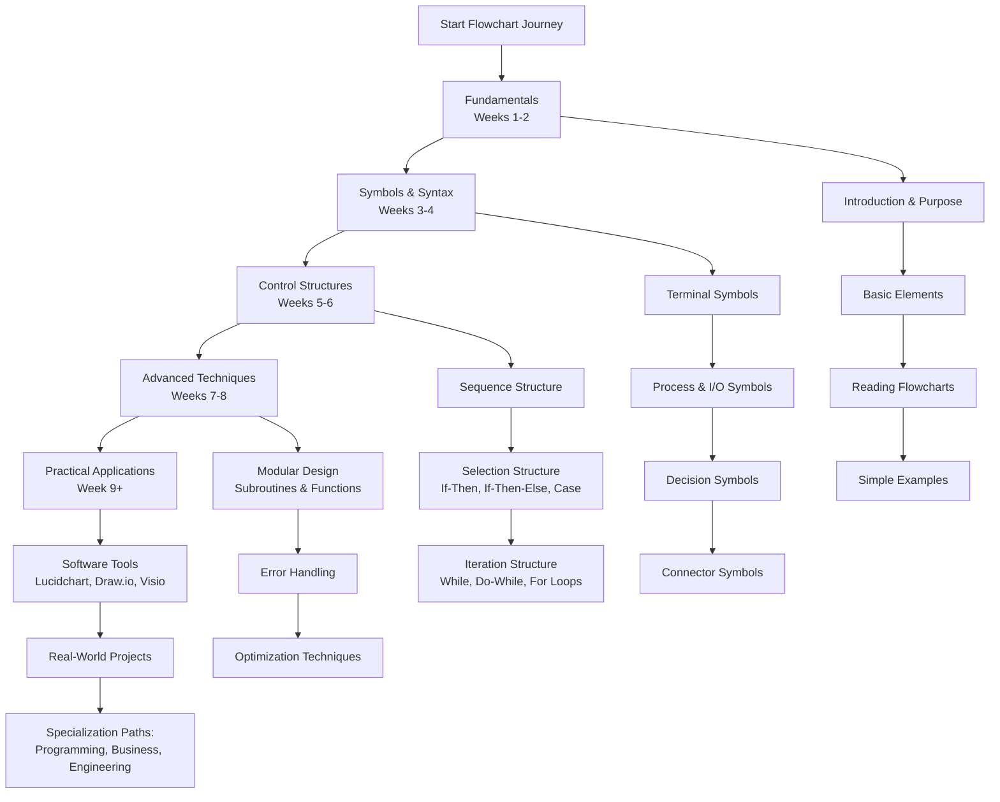

# Flowchart Mastery: A Comprehensive Learning Guide

This structured curriculum provides a complete path to mastering flowcharts, from fundamental concepts to advanced techniques and practical applications. The modules are designed to build upon each other, ensuring a solid foundation in visual problem-solving and algorithmic thinking.

---

## Phase 1: Flowchart Fundamentals (Weeks 1-2)

*   [**Module 1: Introduction to Flowcharts**](https://github.com/ahmadrizal1st/flowchart-introduction/#readme)
    *   What are Flowcharts? Definition and Historical Background
    *   Purpose and Benefits of Using Flowcharts in Problem-Solving
    *   Applications Across Different Fields: Programming, Business, Engineering
    *   Basic Principles of Visual Algorithm Representation
    *   Understanding the Flow of Control and Data

*   [**Module 2: Basic Flowchart Elements**](https://github.com/ahmadrizal1st/flowchart-elements/#readme)
    *   The Concept of Processes and Operations
    *   Understanding Inputs and Outputs
    *   Decision Points and Conditional Logic
    *   Flow Direction and Arrow Conventions
    *   Start and End Points of Processes

*   [**Module 3: Reading and Interpreting Flowcharts**](https://github.com/ahmadrizal1st/flowchart-reading/#readme)
    *   How to Follow Flowchart Logic Step by Step
    *   Tracing Execution Paths
    *   Understanding Process Flow in Different Scenarios
    *   Common Patterns in Simple Flowcharts
    *   Practice Exercises with Basic Flowchart Examples

*   [**Module 4: Simple Flowchart Creation**](https://github.com/ahmadrizal1st/flowchart-creation/#readme)
    *   Steps to Create Your First Flowchart
    *   Identifying the Problem to be Solved
    *   Breaking Down Processes into Sequential Steps
    *   Drawing Basic Linear Processes
    *   Validating Flowchart Logic and Completeness

---

## Phase 2: Flowchart Symbols and Syntax (Weeks 3-4)

*   [**Module 5: Standard Flowchart Symbols**](https://github.com/ahmadrizal1st/flowchart-symbols/#readme)
    *   **Terminal Symbols:** Ovals for Start/End Points
    *   **Process Symbols:** Rectangles for Operations and Calculations
    *   **Input/Output Symbols:** Parallelograms for Data Input and Output
    *   **Decision Symbols:** Diamonds for Conditional Branching
    *   **Flowline Symbols:** Arrows Showing Direction of Flow

*   [**Module 6: Advanced Symbol Set**](https://github.com/ahmadrizal1st/flowchart-advanced-symbols/#readme)
    *   **Connector Symbols:** Circles for Connecting Different Parts
    *   **Predefined Process Symbols:** Rectangles with Double Lines for Subroutines
    *   **Document Symbols:** Rectangles with Wavy Bottom for Documents
    *   **Database Symbols:** Cylinders for Data Storage
    *   **Delay Symbols:** Half-Ovals for Wait States or Delays

*   [**Module 7: Symbol Usage Guidelines**](https://github.com/ahmadrizal1st/flowchart-guidelines/#readme)
    *   Proper Sizing and Proportion of Symbols
    *   Consistent Symbol Placement and Alignment
    *   Text Placement Within Symbols
    *   Arrow Placement and Direction Conventions
    *   Best Practices for Symbol Selection

*   [**Module 8: Flowchart Notation Standards**](https://github.com/ahmadrizal1st/flowchart-standards/#readme)
    *   ISO 5807:1985 Flowchart Standards
    *   ANSI Flowchart Standards
    *   Industry-Specific Conventions
    *   Creating Readable and Professional Flowcharts
    *   Common Mistakes to Avoid in Symbol Usage

---

## Phase 3: Control Structures and Logic Flow (Weeks 5-6)

*   [**Module 9: Sequence Structure**](https://github.com/ahmadrizal1st/flowchart-sequence/#readme)
    *   Linear Process Flow Without Branching
    *   Sequential Execution of Operations
    *   Connecting Multiple Process Steps
    *   Examples of Pure Sequential Processes
    *   Advantages and Limitations of Sequential Flow

*   [**Module 10: Selection Structures**](https://github.com/ahmadrizal1st/flowchart-selection/#readme)
    *   **If-Then Structure:** Single Condition Checking
    *   **If-Then-Else Structure:** Binary Decision Making
    *   **Nested If Statements:** Multiple Conditional Levels
    *   **Case/Switch Structure:** Multi-way Branching
    *   Flowchart Patterns for Complex Decision Trees

*   [**Module 11: Iteration Structures (Loops)**](https://github.com/ahmadrizal1st/flowchart-iteration/#readme)
    *   **While Loops:** Pre-test Iteration Structure
    *   **Do-While Loops:** Post-test Iteration Structure
    *   **For Loops:** Counter-controlled Iteration
    *   Loop Termination Conditions and Exit Criteria
    *   Avoiding Infinite Loops and Logic Errors

*   [**Module 12: Combined Control Structures**](https://github.com/ahmadrizal1st/flowchart-combined/#readme)
    *   Nesting Different Control Structures
    *   Loops Within Conditional Statements
    *   Conditional Logic Within Loops
    *   Complex Flowchart Design Patterns
    *   Maintaining Readability in Complex Flowcharts

---

## Phase 4: Advanced Flowchart Techniques (Weeks 7-8)

*   [**Module 13: Modular Flowchart Design**](https://github.com/ahmadrizal1st/flowchart-modular/#readme)
    *   Decomposition of Complex Processes
    *   Using Predefined Process Symbols for Subroutines
    *   Creating Hierarchical Flowchart Structures
    *   Module Interface Design and Data Passing
    *   Advantages of Modular Approach in Large Systems

*   [**Module 14: Error Handling and Exception Flow**](https://github.com/ahmadrizal1st/flowchart-error-handling/#readme)
    *   Representing Error Conditions in Flowcharts
    *   Exception Handling Pathways
    *   Validation Steps and Error Checking
    *   Recovery Procedures and Alternative Flows
    *   Designing Robust Processes with Error Management

*   [**Module 15: Flowchart Optimization**](https://github.com/ahmadrizal1st/flowchart-optimization/#readme)
    *   Simplifying Complex Flowcharts
    *   Reducing Redundancy and Improving Efficiency
    *   Balancing Detail Level with Readability
    *   Performance Considerations in Process Design
    *   Tools for Flowchart Analysis and Optimization

*   [**Module 16: Cross-Functional Flowcharts**](https://github.com/ahmadrizal1st/flowchart-cross-functional/#readme)
    *   Swimlane Diagrams for Multiple Actors/Departments
    *   Representing Parallel Processes
    *   Synchronization Points in Concurrent Flows
    *   Data Flow Between Different Functional Units
    *   Applications in Business Process Modeling

---

## Phase 5: Practical Applications and Tools (Week 9+)

*   [**Module 17: Flowchart Software Tools**](https://github.com/ahmadrizal1st/flowchart-tools/#readme)
    *   **Web-Based Tools:** Lucidchart, Draw.io, Gliffy
    *   **Desktop Applications:** Microsoft Visio, yEd, Dia
    *   **Programming Integration:** PlantUML, Mermaid.js
    *   **Collaboration Features:** Real-time Editing, Commenting
    *   **Export Options:** PDF, PNG, SVG Formats

*   [**Module 18: Real-World Project Development**](https://github.com/ahmadrizal1st/flowchart-projects/#readme)
    *   **Project 1:** Develop a Complete Business Process Flowchart
    *   **Project 2:** Create an Algorithm Flowchart for a Programming Problem
    *   **Project 3:** Design a System Workflow for an Application
    *   **Project 4:** Document an Existing Process with Flowcharts
    *   Best Practices for Documentation and Presentation

*   [**Module 19: Specialization Paths**](https://github.com/ahmadrizal1st/flowchart-specialization/#readme)
    *   **Programming & Software Development:**
        *   Algorithm Design and Analysis
        *   Program Logic Representation
        *   Software Development Lifecycle Documentation
    *   **Business Process Management:**
        *   Workflow Optimization
        *   Standard Operating Procedures (SOPs)
        *   Quality Management and ISO Certification
    *   **Engineering & Systems Design:**
        *   Electrical and Electronic Circuit Design
        *   Mechanical Process Flows
        *   System Architecture Documentation

*   [**Module 20: Advanced Topics and Future Trends**](https://github.com/ahmadrizal1st/flowchart-advanced/#readme)
    *   Interactive Flowcharts and Dynamic Visualization
    *   Integration with Agile and DevOps Methodologies
    *   AI-Assisted Flowchart Generation and Optimization
    *   Flowcharts in Data Science and Machine Learning Pipelines
    *   Emerging Standards and Future Developments
